Learning Patterns in ggplot2: ggpattern and fillpattern
================
Learning Notes
2026-05-23

  - [Overview](#overview)
  - [Setup](#setup)
  - [Part 1: Pattern Categories in
    ggpattern](#part-1-pattern-categories-in-ggpattern)
      - [1.1 Stripe Patterns](#11-stripe-patterns)
          - [Controlling Stripe Orientation and
            Density](#controlling-stripe-orientation-and-density)
      - [1.2 Geometric Patterns](#12-geometric-patterns)
          - [Controlling Shape Size and
            Density](#controlling-shape-size-and-density)
      - [1.3 Noise/Gradient Patterns](#13-noisegradient-patterns)
  - [Part 2: Using Patterns as
    Aesthetics](#part-2-using-patterns-as-aesthetics)
      - [2.1 Mapping Patterns to Categorical
        Variables](#21-mapping-patterns-to-categorical-variables)
      - [2.2 Combining Pattern and Fill
        Aesthetics](#22-combining-pattern-and-fill-aesthetics)
      - [2.3 Mapping Multiple Pattern
        Parameters](#23-mapping-multiple-pattern-parameters)
  - [Part 3: Key Pattern Parameters](#part-3-key-pattern-parameters)
      - [3.1 Core Pattern Control
        Parameters](#31-core-pattern-control-parameters)
          - [Important Distinction: density vs
            spacing](#important-distinction-density-vs-spacing)
      - [3.2 Pattern Shape Control (for
        regular\_polygon)](#32-pattern-shape-control-for-regular_polygon)
  - [Part 4: Legend Key Control](#part-4-legend-key-control)
      - [4.1 The Critical Parameter:
        pattern\_key\_scale\_factor](#41-the-critical-parameter-pattern_key_scale_factor)
          - [How pattern\_key\_scale\_factor
            Works](#how-pattern_key_scale_factor-works)
      - [4.2 Combining with theme() for Perfect
        Legends](#42-combining-with-theme-for-perfect-legends)
  - [Part 5: Advanced Techniques](#part-5-advanced-techniques)
      - [5.1 Pattern Fill vs Base Fill](#51-pattern-fill-vs-base-fill)
      - [5.2 Using Patterns for
        Accessibility](#52-using-patterns-for-accessibility)
      - [5.3 Complex Multi-Parameter
        Patterns](#53-complex-multi-parameter-patterns)
  - [Part 6: fillpattern Package](#part-6-fillpattern-package)
      - [6.1 Introduction to
        fillpattern](#61-introduction-to-fillpattern)
      - [6.2 Basic fillpattern Usage](#62-basic-fillpattern-usage)
      - [6.3 Comparing ggpattern vs
        fillpattern](#63-comparing-ggpattern-vs-fillpattern)
  - [Part 7: Best Practices and Tips](#part-7-best-practices-and-tips)
      - [7.1 Essential Guidelines](#71-essential-guidelines)
          - [Always Set
            pattern\_key\_scale\_factor](#always-set-pattern_key_scale_factor)
          - [Choose Appropriate Patterns](#choose-appropriate-patterns)
          - [Optimize Performance](#optimize-performance)
      - [7.2 Common Patterns
        Combinations](#72-common-patterns-combinations)
      - [7.3 Troubleshooting](#73-troubleshooting)
          - [Patterns Not Visible in
            Legend](#patterns-not-visible-in-legend)
          - [Patterns Too Dense/Sparse](#patterns-too-densesparse)
          - [Slow Rendering](#slow-rendering)
          - [Patterns Don’t Match
            Aesthetic](#patterns-dont-match-aesthetic)
  - [Key Takeaways](#key-takeaways)
      - [Essential Pattern Parameters
        Summary](#essential-pattern-parameters-summary)
      - [Pattern Categories](#pattern-categories)
      - [Critical Functions](#critical-functions)
      - [Best Practices Checklist](#best-practices-checklist)
  - [Session Info](#session-info)

# Overview

This document explores two packages for adding patterns to ggplot2
visualizations:

  - **ggpattern**: Feature-rich package with extensive pattern types and
    customization
  - **fillpattern**: Simpler, more performant alternative with basic
    pattern support

**Performance Note**: ggpattern can be quite slow, especially with
complex patterns or large datasets, due to its grid-based rendering
implementation. For production visualizations with large data, consider
fillpattern or pre-generating pattern images.

Focus areas: 1. Using patterns as aesthetics 2. Controlling pattern
shapes, densities, and appearance 3. Ensuring patterns appear properly
in legend keys

# Setup

``` r
# Install packages if needed
install.packages("ggpattern")
install.packages("fillpattern")
```

``` r
library(ggplot2)
library(ggpattern)
library(dplyr)
```

-----

# Part 1: Pattern Categories in ggpattern

ggpattern organizes patterns into three main categories based on their
rendering approach:

## 1.1 Stripe Patterns

**Pattern types**: `stripe`, `crosshatch`, `wave`, `weave`

These are line-based patterns with regular spacing. They are the most
commonly used and relatively performant.

**Key parameters**: - `pattern_density`: Controls how many lines appear
(higher = more lines) - `pattern_spacing`: Distance between pattern
elements (lower = denser) - `pattern_angle`: Rotation angle in degrees
(0 = vertical, 90 = horizontal, 45 = diagonal)

``` r
df_stripes <- data.frame(
  pattern_type = c("stripe", "crosshatch", "wave", "weave"),
  value = c(10, 10, 10, 10)
)

ggplot(df_stripes, aes(x = pattern_type, y = value)) +
  geom_col_pattern(
    aes(pattern = pattern_type),
    fill = "lightblue",
    colour = "black",
    pattern_fill = "navy",
    pattern_spacing = 0.025,
    pattern_density = 0.5,
    pattern_key_scale_factor = 1.5
  ) +
  scale_pattern_manual(values = c("stripe", "crosshatch", "wave", "weave")) +
  theme_minimal() +
  labs(
    title = "Stripe-Based Patterns",
    subtitle = "Regular line-based patterns"
  )
```

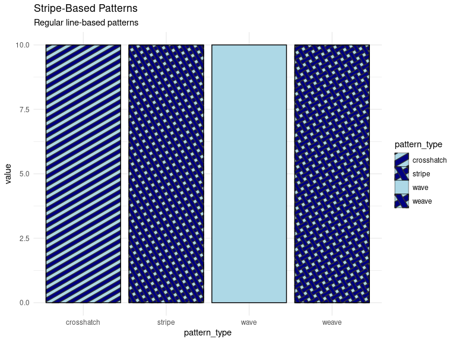<!-- -->

### Controlling Stripe Orientation and Density

``` r
df_angles <- data.frame(
  group = c("Vertical\n(0°)", "Horizontal\n(90°)", "Diagonal\n(45°)",
            "Dense\n(spacing=0.01)", "Sparse\n(spacing=0.05)"),
  angle = c(0, 90, 45, 45, 45),
  spacing = c(0.025, 0.025, 0.025, 0.01, 0.05),
  value = c(10, 10, 10, 10, 10)
)

ggplot(df_angles, aes(x = group, y = value)) +
  geom_col_pattern(
    aes(pattern_angle = angle, pattern_spacing = spacing),
    pattern = "stripe",
    pattern_fill = "darkred",
    fill = "pink",
    colour = "black",
    pattern_key_scale_factor = 1.5
  ) +
  theme_minimal() +
  labs(
    title = "Controlling Stripe Angle and Spacing",
    subtitle = "Lower spacing = denser patterns"
  ) +
  theme(axis.text.x = element_text(size = 9))
```

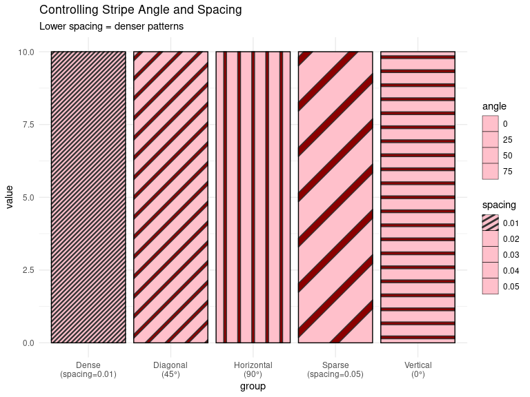<!-- -->

## 1.2 Geometric Patterns

**Pattern types**: `circle`, `regular_polygon`, `rose`, `pch`

These patterns fill the space with repeated geometric shapes.

**Key parameters**: - `pattern_size`: Size of individual pattern
elements (larger = bigger shapes) - `pattern_spacing`: Distance between
shapes (lower = more tightly packed) - `pattern_shape`: For
`regular_polygon`, number of sides (3=triangle, 4=square, etc.) -
`pattern_density`: Controls how many shapes appear per unit area

``` r
df_geom <- data.frame(
  pattern_type = c("circle", "regular_polygon", "rose"),
  value = c(10, 10, 10)
)

ggplot(df_geom, aes(x = pattern_type, y = value)) +
  geom_col_pattern(
    aes(pattern = pattern_type),
    fill = "lightyellow",
    colour = "black",
    pattern_fill = "darkgreen",
    pattern_size = 10,
    pattern_spacing = 0.03,
    pattern_shape = 6,  # hexagon for regular_polygon (ignored for other patterns)
    pattern_key_scale_factor = 2.0
  ) +
  scale_pattern_manual(
    values = c("circle", "regular_polygon", "rose")
  ) +
  theme_minimal() +
  labs(
    title = "Geometric Patterns",
    subtitle = "Shape-based patterns (hexagon shown for regular_polygon)"
  )
```

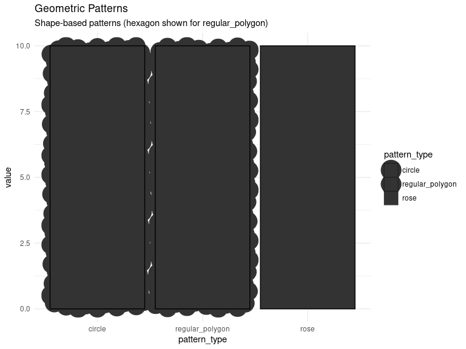<!-- -->

### Controlling Shape Size and Density

``` r
df_size <- data.frame(
  label = c("Small\n(size=5)", "Medium\n(size=10)", "Large\n(size=15)",
            "Dense\n(spacing=0.02)", "Sparse\n(spacing=0.05)"),
  size = c(5, 10, 15, 10, 10),
  spacing = c(0.03, 0.03, 0.03, 0.02, 0.05),
  value = c(10, 10, 10, 10, 10)
)

ggplot(df_size, aes(x = label, y = value)) +
  geom_col_pattern(
    aes(pattern_size = size, pattern_spacing = spacing),
    pattern = "circle",
    pattern_fill = "purple",
    fill = "lavender",
    colour = "black",
    pattern_key_scale_factor = 1.8
  ) +
  theme_minimal() +
  labs(
    title = "Controlling Geometric Pattern Size and Spacing",
    subtitle = "Larger size = bigger shapes; smaller spacing = denser packing"
  ) +
  theme(axis.text.x = element_text(size = 9))
```

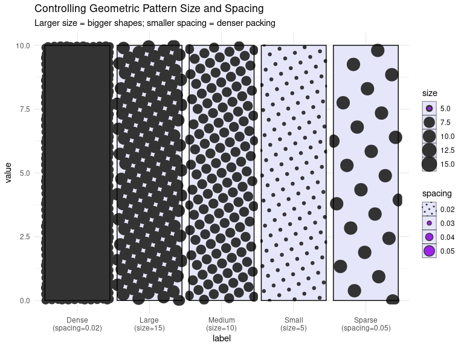<!-- -->

## 1.3 Noise/Gradient Patterns

**Pattern types**: `gradient`, `plasma`, `ambient`

These are algorithmic patterns that create smooth, noise-based fills.
They can be quite slow to render.

**Key parameters**: - `pattern_fill`, `pattern_fill2`: Colors for
gradient endpoints - `pattern_orientation`: Direction of gradient -
`pattern_frequency`: For plasma/ambient, controls noise frequency

``` r
df_noise <- data.frame(
  pattern_type = c("gradient", "plasma"),
  value = c(10, 10)
)

ggplot(df_noise, aes(x = pattern_type, y = value)) +
  geom_col_pattern(
    aes(pattern = pattern_type),
    fill = "white",
    colour = "black",
    pattern_fill = "blue",
    pattern_fill2 = "red",
    pattern_key_scale_factor = 1.5
  ) +
  scale_pattern_manual(values = c("gradient", "plasma")) +
  theme_minimal() +
  labs(
    title = "Noise/Gradient Patterns",
    subtitle = "Algorithmic patterns (slow to render)"
  )
```

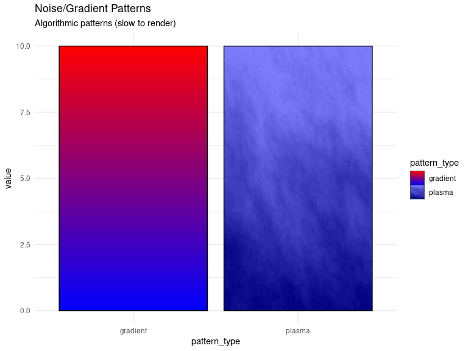<!-- -->

-----

# Part 2: Using Patterns as Aesthetics

## 2.1 Mapping Patterns to Categorical Variables

Just like you map `fill` or `color` to variables, you can map `pattern`
to distinguish groups.

``` r
ggplot(mtcars, aes(x = factor(cyl), y = mpg)) +
  geom_boxplot_pattern(
    aes(pattern = factor(cyl)),
    pattern_fill = "gray30",
    fill = "white",
    pattern_spacing = 0.025,
    pattern_key_scale_factor = 1.5
  ) +
  scale_pattern_manual(
    name = "Cylinders",
    values = c("stripe", "crosshatch", "circle")
  ) +
  theme_minimal() +
  labs(
    title = "Patterns Mapped to Cylinder Count",
    subtitle = "Different pattern types for each group"
  )
```

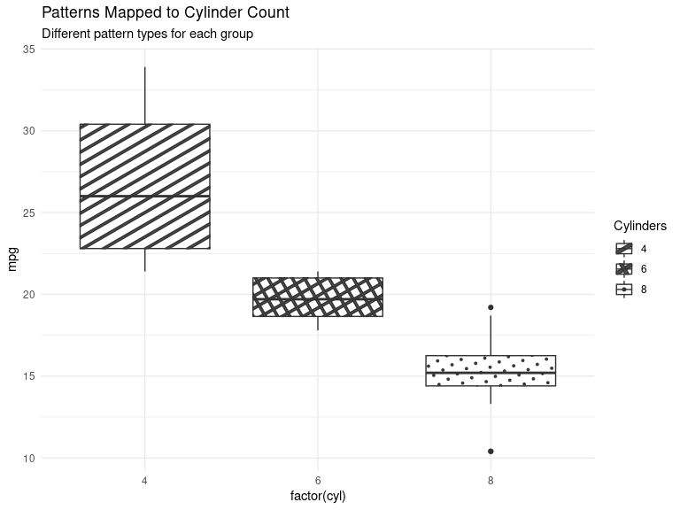<!-- -->

## 2.2 Combining Pattern and Fill Aesthetics

You can map both `fill` color and `pattern` type to different variables
for multi-dimensional encoding.

``` r
ggplot(mtcars, aes(x = factor(cyl), fill = factor(am))) +
  geom_bar_pattern(
    aes(pattern = factor(am)),
    position = "dodge",
    colour = "black",
    pattern_fill = "gray20",
    pattern_spacing = 0.025,
    pattern_key_scale_factor = 1.5
  ) +
  scale_pattern_manual(
    name = "Transmission",
    values = c("stripe", "crosshatch"),
    labels = c("Automatic", "Manual")
  ) +
  scale_fill_manual(
    name = "Transmission",
    values = c("steelblue", "coral"),
    labels = c("Automatic", "Manual")
  ) +
  theme_minimal() +
  labs(
    title = "Pattern Type and Fill Color by Transmission",
    subtitle = "Two aesthetics encoding the same variable"
  )
```

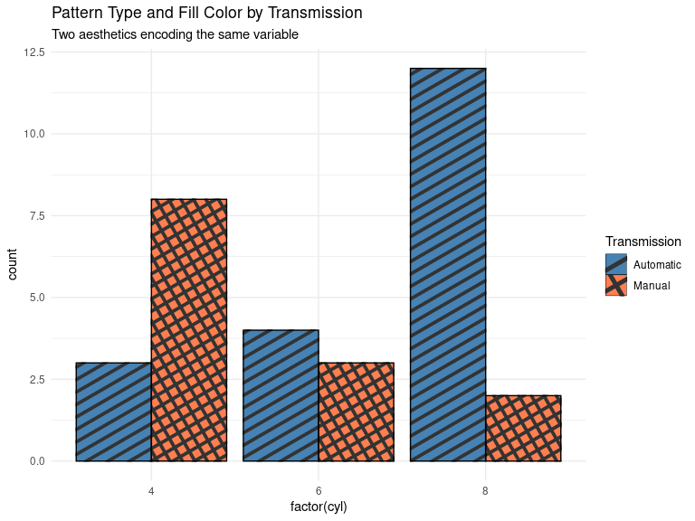<!-- -->

## 2.3 Mapping Multiple Pattern Parameters

You can map multiple pattern aesthetics (density, angle, type) to
variables for fine control.

``` r
ggplot(mtcars, aes(x = factor(cyl), fill = factor(gear))) +
  geom_bar_pattern(
    aes(
      pattern = factor(gear),
      pattern_angle = as.numeric(factor(gear)) * 30,  # 30°, 60°, 90°
      pattern_density = as.numeric(factor(gear)) * 0.15  # 0.15, 0.3, 0.45
    ),
    position = "dodge",
    colour = "black",
    pattern_fill = "gray30",
    pattern_key_scale_factor = 1.8
  ) +
  scale_pattern_manual(
    name = "Gears",
    values = c("stripe", "crosshatch", "circle")
  ) +
  scale_fill_manual(
    name = "Gears",
    values = c("#E69F00", "#56B4E9", "#009E73")
  ) +
  theme_minimal() +
  labs(
    title = "Multiple Pattern Aesthetics",
    subtitle = "Varying pattern type, angle, and density by gear count"
  )
```

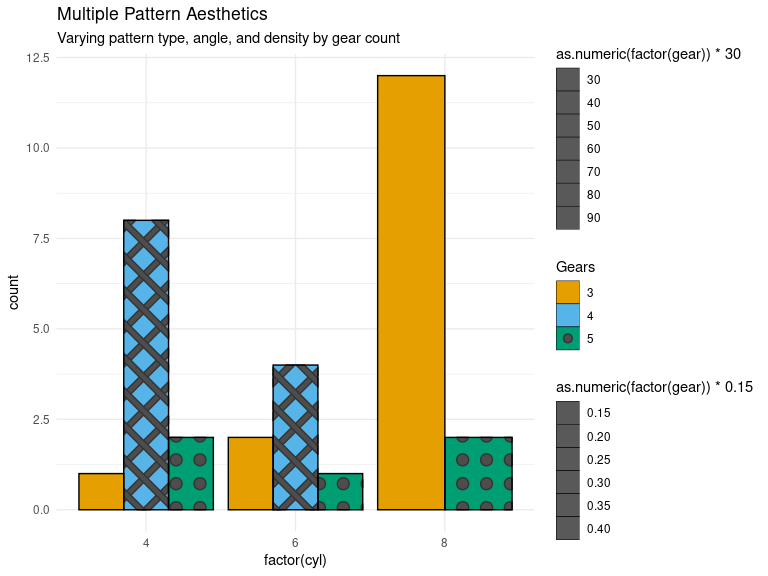<!-- -->

-----

# Part 3: Key Pattern Parameters

## 3.1 Core Pattern Control Parameters

| Parameter         | Effect When Increased                                         | Typical Range | Notes                                             |
| ----------------- | ------------------------------------------------------------- | ------------- | ------------------------------------------------- |
| `pattern_density` | More pattern elements appear, making pattern denser           | 0.1 - 1.0     | Higher values = more crowded patterns             |
| `pattern_spacing` | Pattern elements spread farther apart, making pattern sparser | 0.01 - 0.1    | **Lower values = denser** (inverse relationship)  |
| `pattern_angle`   | Rotates pattern clockwise by specified degrees                | 0 - 360       | 0=vertical, 45=diagonal, 90=horizontal            |
| `pattern_size`    | Individual pattern elements become larger                     | 1 - 20        | Applies to geometric patterns (circles, polygons) |
| `pattern_fill`    | Changes the color of the pattern elements themselves          | Any color     | The “ink” color of the pattern                    |
| `pattern_colour`  | Changes the outline/stroke color of pattern elements          | Any color     | Use British spelling `colour`                     |

### Important Distinction: density vs spacing

  - **`pattern_density`**: Controls how many elements appear (higher =
    more elements)
  - **`pattern_spacing`**: Controls distance between elements (lower =
    elements closer together)

For stripe patterns, reducing `pattern_spacing` makes stripes closer
together (denser). Increasing `pattern_density` adds more stripes
overall.

``` r
df_compare <- data.frame(
  type = rep(c("Density\nControl", "Spacing\nControl"), each = 3),
  level = rep(c("Low", "Medium", "High"), 2),
  density = c(0.2, 0.5, 0.8, 0.5, 0.5, 0.5),
  spacing = c(0.03, 0.03, 0.03, 0.05, 0.03, 0.015),
  x = 1:6
)

ggplot(df_compare, aes(x = factor(x), y = 10)) +
  geom_col_pattern(
    aes(pattern_density = density, pattern_spacing = spacing),
    pattern = "stripe",
    pattern_fill = "navy",
    fill = "lightblue",
    colour = "black",
    pattern_key_scale_factor = 1.5
  ) +
  scale_x_discrete(labels = paste(df_compare$type, df_compare$level, sep = "\n")) +
  theme_minimal() +
  labs(
    title = "Pattern Density vs Spacing",
    subtitle = "Density: 0.2→0.5→0.8 | Spacing: 0.05→0.03→0.015 (note inverse)",
    x = NULL,
    y = "Value"
  ) +
  theme(axis.text.x = element_text(size = 8))
```

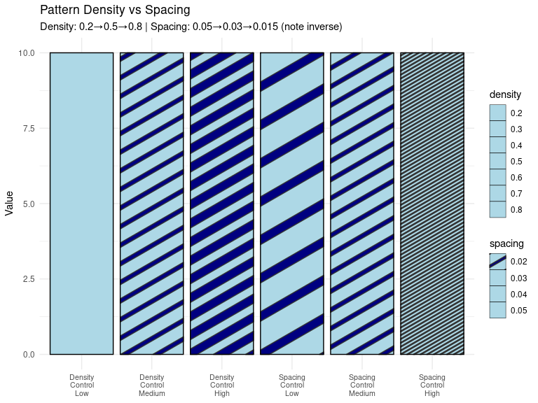<!-- -->

## 3.2 Pattern Shape Control (for regular\_polygon)

The `pattern_shape` parameter controls the number of sides for
`regular_polygon` patterns.

``` r
df_shapes <- data.frame(
  shape_name = c("Triangle", "Square", "Pentagon", "Hexagon", "Octagon"),
  n_sides = c(3, 4, 5, 6, 8),
  value = rep(10, 5)
)

ggplot(df_shapes, aes(x = shape_name, y = value)) +
  geom_col_pattern(
    aes(pattern_shape = factor(n_sides)),
    pattern = "regular_polygon",
    pattern_fill = "darkblue",
    fill = "lightblue",
    colour = "black",
    pattern_size = 12,
    pattern_spacing = 0.03,
    pattern_key_scale_factor = 2.0
  ) +
  scale_pattern_shape_manual(values = c(3, 4, 5, 6, 8)) +
  theme_minimal() +
  labs(
    title = "Regular Polygon Pattern Shapes",
    subtitle = "pattern_shape controls number of sides (3-8 shown)"
  )
```

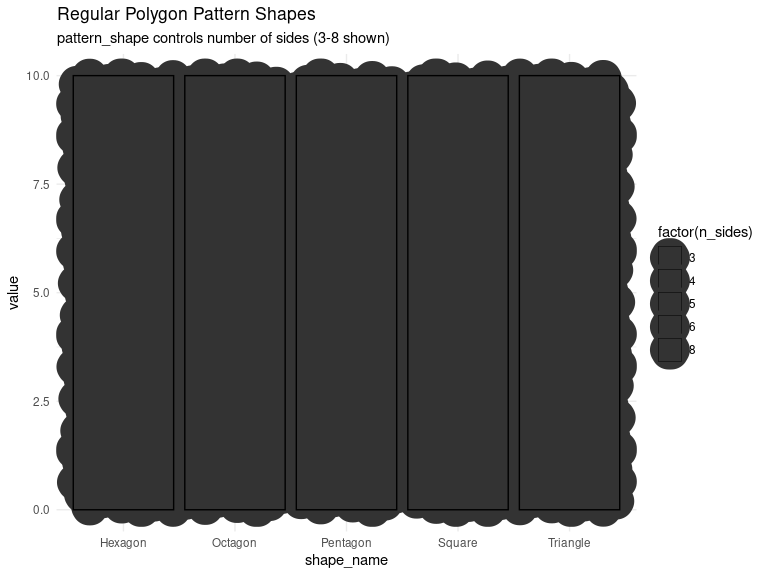<!-- -->

-----

# Part 4: Legend Key Control

## 4.1 The Critical Parameter: pattern\_key\_scale\_factor

**Problem**: By default, patterns in legend keys are often too small or
too sparse to be visible.

**Solution**: Use `pattern_key_scale_factor` to scale up the pattern
appearance in legends without affecting the plot.

``` r
# Without pattern_key_scale_factor (hard to see)
p1 <- ggplot(mtcars, aes(x = factor(cyl), fill = factor(gear))) +
  geom_bar_pattern(
    aes(pattern = factor(gear)),
    position = "dodge",
    colour = "black",
    pattern_spacing = 0.025,
    pattern_fill = "gray30"
  ) +
  scale_pattern_manual(
    name = "Gears",
    values = c("stripe", "crosshatch", "circle")
  ) +
  scale_fill_manual(
    name = "Gears",
    values = c("coral", "steelblue", "lightgreen")
  ) +
  theme_minimal() +
  labs(title = "Default Legend (patterns barely visible)")

# With pattern_key_scale_factor (much clearer)
p2 <- ggplot(mtcars, aes(x = factor(cyl), fill = factor(gear))) +
  geom_bar_pattern(
    aes(pattern = factor(gear)),
    position = "dodge",
    colour = "black",
    pattern_spacing = 0.025,
    pattern_fill = "gray30",
    pattern_key_scale_factor = 1.8  # Makes patterns visible in legend
  ) +
  scale_pattern_manual(
    name = "Gears",
    values = c("stripe", "crosshatch", "circle")
  ) +
  scale_fill_manual(
    name = "Gears",
    values = c("coral", "steelblue", "lightgreen")
  ) +
  theme_minimal() +
  labs(title = "With pattern_key_scale_factor = 1.8")

p1
```

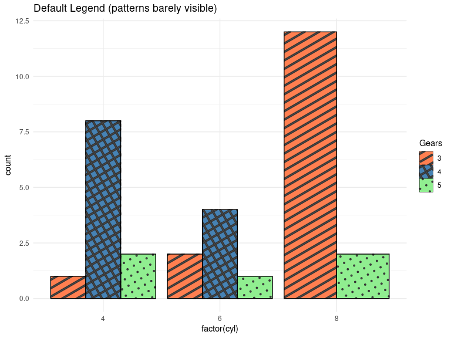<!-- -->

``` r
p2
```

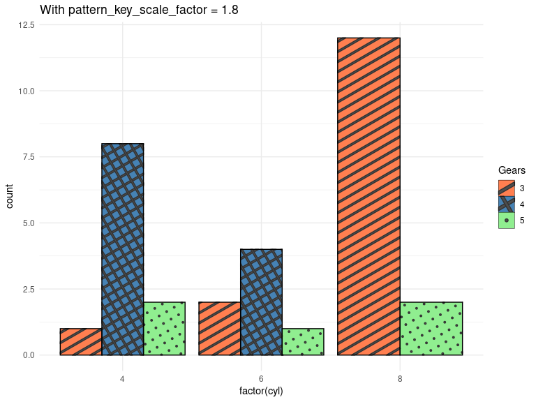<!-- -->

### How pattern\_key\_scale\_factor Works

**What it does**: Multiplies the density/frequency of pattern elements
specifically in the legend keys.

  - **Value = 1.0**: Default (no scaling)
  - **Value = 1.5-2.0**: Recommended for most patterns (50-100% more
    dense in legend)
  - **Value \> 2.0**: For very sparse patterns or geometric patterns

**Note**: This parameter only affects the legend appearance, not the
plot itself.

## 4.2 Combining with theme() for Perfect Legends

For optimal legend visibility, combine `pattern_key_scale_factor` with
`theme()` settings.

``` r
ggplot(mtcars, aes(x = factor(cyl), fill = factor(am))) +
  geom_boxplot_pattern(
    aes(pattern = factor(am), pattern_angle = factor(am)),
    colour = "black",
    pattern_fill = "gray20",
    pattern_spacing = 0.025,
    pattern_key_scale_factor = 2.0  # Double density in legend
  ) +
  scale_pattern_manual(
    name = "Transmission",
    values = c("stripe", "crosshatch"),
    labels = c("Automatic", "Manual")
  ) +
  scale_pattern_angle_manual(
    name = "Transmission",
    values = c(45, 0),
    labels = c("Automatic", "Manual")
  ) +
  scale_fill_manual(
    name = "Transmission",
    values = c("coral", "steelblue"),
    labels = c("Automatic", "Manual")
  ) +
  theme_minimal() +
  theme(
    legend.key.size = unit(1.5, "cm"),  # Larger legend boxes
    legend.key = element_rect(colour = "black"),  # Border around keys
    legend.position = "right"
  ) +
  labs(
    title = "Perfect Pattern Legends",
    subtitle = "pattern_key_scale_factor + large legend.key.size",
    x = "Cylinders",
    y = "MPG"
  )
```

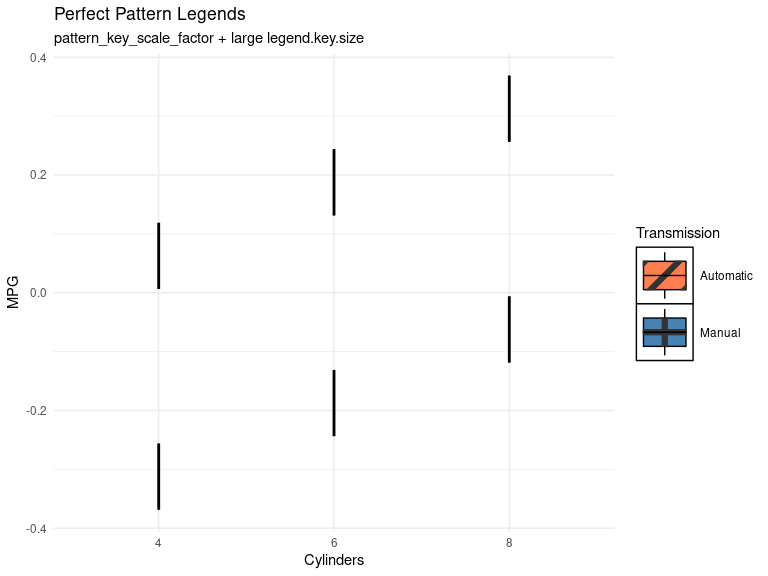<!-- -->

-----

# Part 5: Advanced Techniques

## 5.1 Pattern Fill vs Base Fill

Understanding the relationship between `fill` and `pattern_fill`:

  - **`fill`**: Background color of the entire geom area
  - **`pattern_fill`**: Color of the pattern elements themselves

<!-- end list -->

``` r
df_fills <- data.frame(
  combo = c("Light bg\nDark pattern", "Dark bg\nLight pattern",
            "White bg\nColored pattern", "Colored bg\nWhite pattern"),
  fill_color = c("lightblue", "navy", "white", "coral"),
  pattern_color = c("navy", "lightblue", "red", "white"),
  value = c(10, 10, 10, 10)
)

ggplot(df_fills, aes(x = combo, y = value)) +
  geom_col_pattern(
    aes(fill = fill_color, pattern_fill = pattern_color),
    pattern = "stripe",
    pattern_spacing = 0.025,
    colour = "black",
    pattern_key_scale_factor = 1.5
  ) +
  scale_fill_identity() +
  scale_pattern_fill_identity() +
  theme_minimal() +
  labs(
    title = "Base Fill vs Pattern Fill",
    subtitle = "Contrasting colors improve pattern visibility"
  )
```

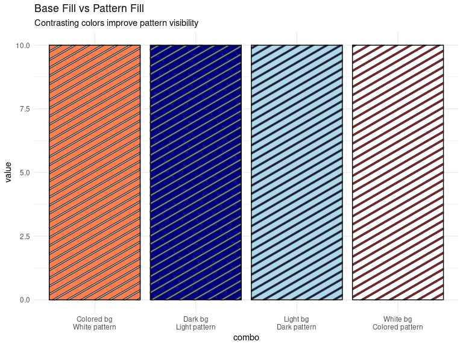<!-- -->

## 5.2 Using Patterns for Accessibility

Patterns are valuable for creating colorblind-friendly visualizations.
Combine with colorblind-safe palettes.

``` r
# Colorblind-safe palette + patterns
ggplot(mtcars, aes(x = factor(cyl), fill = factor(gear))) +
  geom_bar_pattern(
    aes(pattern = factor(gear)),
    position = "dodge",
    colour = "black",
    pattern_fill = "gray30",
    pattern_spacing = 0.025,
    pattern_key_scale_factor = 1.8
  ) +
  scale_pattern_manual(
    name = "Gears",
    values = c("stripe", "crosshatch", "none")
  ) +
  scale_fill_manual(
    name = "Gears",
    values = c("#E69F00", "#56B4E9", "#009E73")  # Colorblind-safe
  ) +
  theme_minimal() +
  labs(
    title = "Accessible Visualization with Patterns",
    subtitle = "Patterns + colorblind-safe colors for maximum accessibility"
  )
```

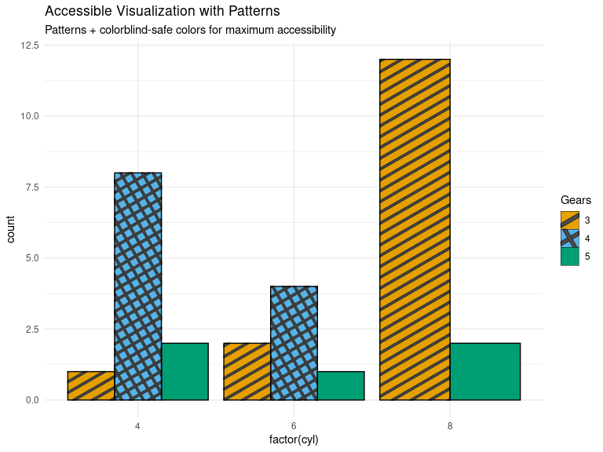<!-- -->

## 5.3 Complex Multi-Parameter Patterns

``` r
# Create sample data with multiple grouping variables
df_complex <- mtcars %>%
  mutate(
    cyl_cat = factor(cyl),
    am_cat = factor(am, labels = c("Auto", "Manual")),
    gear_cat = factor(gear)
  ) %>%
  group_by(cyl_cat, am_cat) %>%
  summarise(mean_mpg = mean(mpg), .groups = "drop")

ggplot(df_complex, aes(x = cyl_cat, y = mean_mpg, fill = am_cat)) +
  geom_col_pattern(
    aes(
      pattern = am_cat,
      pattern_angle = as.numeric(am_cat) * 45,
      pattern_spacing = 0.02 + as.numeric(am_cat) * 0.01
    ),
    position = "dodge",
    colour = "black",
    pattern_fill = "gray20",
    pattern_key_scale_factor = 2.0
  ) +
  scale_pattern_manual(
    name = "Transmission",
    values = c("stripe", "crosshatch")
  ) +
  scale_fill_manual(
    name = "Transmission",
    values = c("#1b9e77", "#d95f02")
  ) +
  theme_minimal() +
  theme(
    legend.key.size = unit(1.3, "cm"),
    legend.position = "right"
  ) +
  labs(
    title = "Average MPG by Cylinders and Transmission",
    subtitle = "Multiple pattern parameters for rich encoding",
    x = "Cylinders",
    y = "Mean MPG"
  )
```

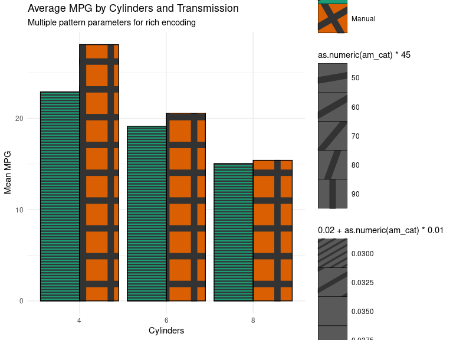<!-- -->

-----

# Part 6: fillpattern Package

## 6.1 Introduction to fillpattern

`fillpattern` is a lighter-weight alternative to `ggpattern` with: -
**Better performance**: Faster rendering for large datasets - **Simpler
API**: Fewer pattern types and options - **Different approach**: Uses
grid patterns rather than ggpattern’s rendering engine

## 6.2 Basic fillpattern Usage

``` r
library(fillpattern)

# Sample data
df <- data.frame(
  category = LETTERS[1:4],
  value = c(10, 25, 15, 30)
)

# Basic pattern with fillpattern
# Note: fillpattern uses different pattern names than ggpattern
ggplot(df, aes(x = category, y = value, fill = category)) +
  geom_col() +
  scale_fill_pattern(
    patterns = c("stripe", "stripe45", "grid", "brick"),
    fg = "black"  # Foreground color for pattern lines
  ) +
  theme_minimal() +
  labs(
    title = "fillpattern Example",
    subtitle = "Simpler API with pattern names: stripe, grid, brick, etc."
  )
```

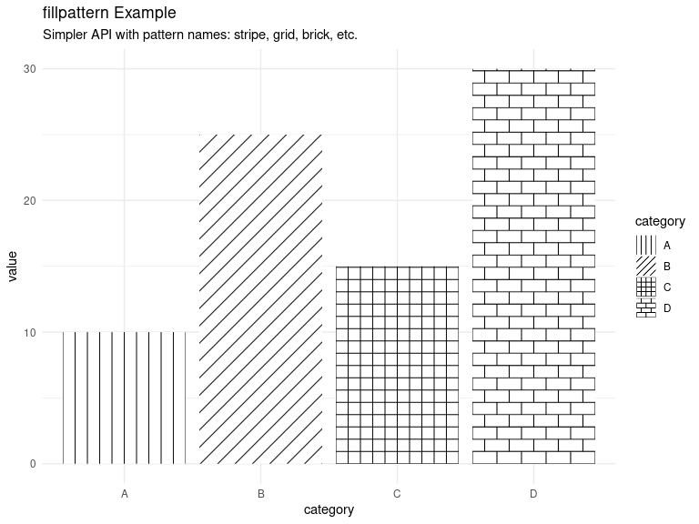<!-- -->

## 6.3 Comparing ggpattern vs fillpattern

| Feature               | ggpattern                                                   | fillpattern                                                               |
| :-------------------- | :---------------------------------------------------------- | :------------------------------------------------------------------------ |
| Pattern types         | 20+ types (stripe, circle, polygon, gradient, etc.)         | 12+ tile patterns (brick, stripe, grid, herringbone, hexagon, fish, etc.) |
| Rendering performance | Slow (grid-based, can be very slow)                         | Fast (optimized grid rendering)                                           |
| Customization level   | High (many parameters: density, spacing, size, angle, etc.) | Moderate (angle, width/height, lwd, lty modifiers)                        |
| Legend control        | Excellent (pattern\_key\_scale\_factor)                     | Works with standard theme settings                                        |
| Learning curve        | Moderate (many parameters to learn)                         | Easy (pattern name strings with modifiers)                                |
| Best use case         | Publication graphics, detailed customization                | Fast rendering, tile-based patterns, production plots                     |

ggpattern vs fillpattern Comparison

-----

# Part 7: Best Practices and Tips

## 7.1 Essential Guidelines

### Always Set pattern\_key\_scale\_factor

``` r
# DO THIS
geom_*_pattern(..., pattern_key_scale_factor = 1.5)

# NOT THIS (patterns invisible in legend)
geom_*_pattern(...)
```

### Choose Appropriate Patterns

  - **For print (B\&W)**: Use stripe, crosshatch, circle
  - **For color**: Combine patterns with distinct colors
  - **For accessibility**: Always use patterns + colors, never color
    alone

### Optimize Performance

``` r
# Slow (avoid for large data)
pattern = "plasma"
pattern = "gradient"

# Fast (good for large data)
pattern = "stripe"
pattern = "circle"
pattern = "none"  # Use when pattern not needed
```

## 7.2 Common Patterns Combinations

| Pattern 1   | Pattern 2        | Pattern 3    | Use Case                             |
| ----------- | ---------------- | ------------ | ------------------------------------ |
| stripe      | crosshatch       | circle       | Classic trio, highly distinguishable |
| stripe (0°) | stripe (45°)     | stripe (90°) | Same pattern, different angles       |
| circle      | regular\_polygon | rose         | All geometric shapes                 |
| stripe      | none             | crosshatch   | Include “no pattern” option          |

## 7.3 Troubleshooting

### Patterns Not Visible in Legend

→ Add `pattern_key_scale_factor = 1.5-2.0`

### Patterns Too Dense/Sparse

→ Adjust `pattern_spacing` (lower = denser) or `pattern_density`

### Slow Rendering

→ Switch from gradient/plasma to stripe/circle patterns → Consider using
fillpattern for large datasets

### Patterns Don’t Match Aesthetic

→ Check `scale_pattern_manual()` values match your pattern types →
Ensure factor levels match pattern assignments

-----

# Key Takeaways

## Essential Pattern Parameters Summary

| Parameter                      | What It Does                                            | Effect When Increased                                                     | Effect When Decreased                          | Recommended Values                           |
| ------------------------------ | ------------------------------------------------------- | ------------------------------------------------------------------------- | ---------------------------------------------- | -------------------------------------------- |
| **`pattern`**                  | Sets the pattern type                                   | N/A                                                                       | N/A                                            | “stripe”, “crosshatch”, “circle”             |
| **`pattern_density`**          | Controls number of pattern elements per unit area       | More elements appear, pattern looks busier/denser                         | Fewer elements, pattern looks sparser          | 0.3-0.7 for most uses                        |
| **`pattern_spacing`**          | Distance between pattern elements                       | Elements spread apart, pattern becomes sparser (**inverse relationship**) | Elements pack together, pattern becomes denser | 0.02-0.03 for stripes                        |
| **`pattern_angle`**            | Rotation of pattern in degrees                          | Pattern rotates clockwise                                                 | Pattern rotates counter-clockwise              | 0 (vertical), 45 (diagonal), 90 (horizontal) |
| **`pattern_size`**             | Size of individual pattern elements (circles, polygons) | Shapes become larger, fewer fit in space                                  | Shapes become smaller, more fit in space       | 8-15 for circles                             |
| **`pattern_fill`**             | Color of the pattern elements themselves                | N/A                                                                       | N/A                                            | Contrasting color to base fill               |
| **`pattern_colour`**           | Outline/stroke color around pattern elements            | N/A                                                                       | N/A                                            | Usually “black” or same as pattern\_fill     |
| **`pattern_key_scale_factor`** | Scales pattern density in legend keys only              | Patterns more visible in legend                                           | Patterns less visible in legend                | **1.5-2.0 (always set this\!)**              |
| **`pattern_shape`**            | Number of sides for regular\_polygon                    | More sides (approaches circle)                                            | Fewer sides (triangle at n=3)                  | 3-8 for clarity                              |

## Pattern Categories

1.  **Stripe patterns**: stripe, crosshatch, wave, weave
      - Most commonly used and relatively fast
      - Control with: `pattern_angle`, `pattern_spacing`,
        `pattern_density`
2.  **Geometric patterns**: circle, regular\_polygon, rose, pch
      - Good for distinct visual encoding
      - Control with: `pattern_size`, `pattern_spacing`, `pattern_shape`
3.  **Noise/gradient patterns**: gradient, plasma, ambient
      - Visually appealing but **very slow to render**
      - Control with: `pattern_fill`, `pattern_fill2`,
        `pattern_frequency`

## Critical Functions

| Function                    | Purpose                                                 | Example                                                 |
| --------------------------- | ------------------------------------------------------- | ------------------------------------------------------- |
| `geom_*_pattern()`          | Pattern versions of standard geoms                      | `geom_col_pattern()`, `geom_boxplot_pattern()`          |
| `scale_pattern_manual()`    | Manually assign pattern types to levels                 | `scale_pattern_manual(values = c("stripe", "circle"))`  |
| `scale_pattern_density_*()` | Control density scales                                  | `scale_pattern_density_continuous(range = c(0.1, 0.9))` |
| `scale_pattern_fill_*()`    | Control pattern fill colors                             | `scale_pattern_fill_manual(values = c("red", "blue"))`  |
| `pattern_key_scale_factor`  | Make patterns visible in legends (**most important\!**) | `pattern_key_scale_factor = 1.8`                        |

## Best Practices Checklist

✅ **Always** set `pattern_key_scale_factor = 1.5-2.0`

✅ Combine `theme(legend.key.size = unit(1.5, "cm"))` with pattern
scaling

✅ Use `pattern_spacing` between 0.02-0.04 for readable stripe patterns

✅ For accessibility, use patterns + colors together, never rely on color
alone

✅ Test patterns in B\&W to ensure they’re distinguishable

✅ Keep it simple: don’t map too many pattern aesthetics at once (max
2-3)

✅ For large datasets or many panels, consider fillpattern instead

⚠️ **Performance**: ggpattern can be very slow, especially with
gradient/plasma patterns

❌ **Avoid**: Using gradient/plasma patterns on large datasets (extremely
slow)

-----

# Session Info

``` r
sessionInfo()
```

    ## R version 4.5.1 (2025-06-13)
    ## Platform: x86_64-pc-linux-gnu
    ## Running under: Ubuntu 22.04.5 LTS
    ## 
    ## Matrix products: default
    ## BLAS:   /usr/lib/x86_64-linux-gnu/openblas-pthread/libblas.so.3 
    ## LAPACK: /usr/lib/x86_64-linux-gnu/openblas-pthread/libopenblasp-r0.3.20.so;  LAPACK version 3.10.0
    ## 
    ## locale:
    ##  [1] LC_CTYPE=C.UTF-8       LC_NUMERIC=C           LC_TIME=C.UTF-8       
    ##  [4] LC_COLLATE=C.UTF-8     LC_MONETARY=C.UTF-8    LC_MESSAGES=C.UTF-8   
    ##  [7] LC_PAPER=C.UTF-8       LC_NAME=C              LC_ADDRESS=C          
    ## [10] LC_TELEPHONE=C         LC_MEASUREMENT=C.UTF-8 LC_IDENTIFICATION=C   
    ## 
    ## time zone: Etc/UTC
    ## tzcode source: system (glibc)
    ## 
    ## attached base packages:
    ## [1] stats     graphics  grDevices utils     datasets  methods   base     
    ## 
    ## other attached packages:
    ## [1] fillpattern_1.0.3 dplyr_1.1.4       ggpattern_1.3.1   ggplot2_4.0.2    
    ## 
    ## loaded via a namespace (and not attached):
    ##  [1] gtable_0.3.6       jsonlite_2.0.0     compiler_4.5.1     Rcpp_1.0.14       
    ##  [5] tidyselect_1.2.1   magick_2.9.0       dichromat_2.0-0.1  png_0.1-8         
    ##  [9] scales_1.4.0       yaml_2.3.10        fastmap_1.2.0      R6_2.6.1          
    ## [13] labeling_0.4.3     generics_0.1.4     classInt_0.4-11    curl_6.4.0        
    ## [17] httr2_1.2.2        sf_1.1-1           knitr_1.50         tibble_3.3.0      
    ## [21] ellmer_0.4.0       units_1.0-1        DBI_1.2.3          pillar_1.10.2     
    ## [25] RColorBrewer_1.1-3 rlang_1.1.6        cachem_1.1.0       xfun_0.55         
    ## [29] gridpattern_1.3.1  S7_0.2.1           memoise_2.0.1      cli_3.6.5         
    ## [33] withr_3.0.2        magrittr_2.0.3     class_7.3-23       digest_0.6.37     
    ## [37] grid_4.5.1         rappdirs_0.3.3     lifecycle_1.0.4    coro_1.1.0        
    ## [41] vctrs_0.6.5        KernSmooth_2.23-26 proxy_0.4-29       evaluate_1.0.4    
    ## [45] glue_1.8.0         farver_2.1.2       e1071_1.7-17       rmarkdown_2.29    
    ## [49] tools_4.5.1        pkgconfig_2.0.3    htmltools_0.5.8.1
