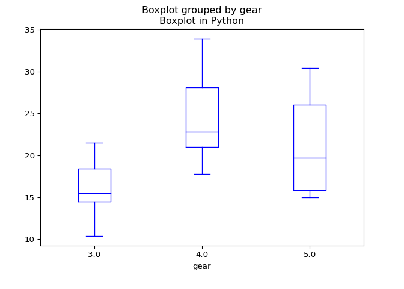
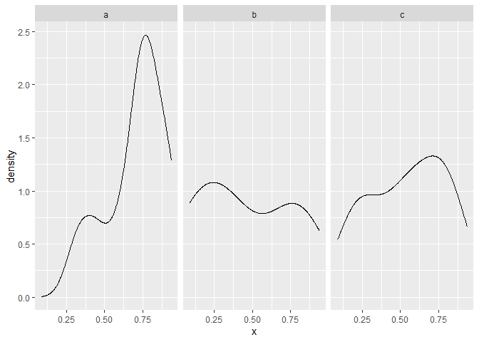

Reticulate: calling python in R
================
June 24, 2023

-   [Introduction](#introduction)
-   [Setup](#setup)
-   [4 ways to call python](#4-ways-to-call-python)
-   [Python in Rmarkdown](#python-in-rmarkdown)
    -   [Run python chunks](#run-python-chunks)
    -   [Access R variables in Python](#access-r-variables-in-python)
    -   [Access Python variables in R](#access-python-variables-in-r)
    -   [Exchanging variables between R and
        Python](#exchanging-variables-between-r-and-python)
-   [Import Python modules](#import-python-modules)
    -   [Summary of Python and R object
        conversion](#summary-of-python-and-r-object-conversion)
-   [Source python code](#source-python-code)
-   [Use Python REPL](#use-python-repl)
-   [Important functions](#important-functions)
    -   [Functions to import python objects into
        R](#functions-to-import-python-objects-into-r)
    -   [Functions that check Python objects without
        conversion](#functions-that-check-python-objects-without-conversion)
    -   [Functions to check Python
        setting](#functions-to-check-python-setting)
    -   [Other useful functions](#other-useful-functions)
-   [Release memory used by Python](#release-memory-used-by-python)
-   [References](#references)

## Introduction

[reticulate](https://rstudio.github.io/reticulate/) is a package
enabling embedding python session in R, which provides convenience for
using some python packages which don’t have R equivalents.

Normally, the conversion between R and python objects takes place
automatically. So one can access the variables from the other language
easily.

## Setup

To call python in R, one need some settings:

1.  install ‘reticulate’ R package.

``` r
install.packages("reticulate")
```

2.  choose the python to use. One can set the right python using the
    functions such as `use_python()`, `use_python_version()`,
    `use_condaenv()`, `use_miniconda()`. If this is not set beforehand,
    it will prompt you to install miniconda, even though you have
    installed pythons somewhere. This setup needs be done only once for
    one account in a machine. See
    [here](https://rstudio.github.io/reticulate/articles/versions.html)
    for more details.

## 4 ways to call python

1.  Python in R Markdown — A new Python language engine for R Markdown
    that supports bi-directional communication between R and Python (R
    chunks can access Python objects and vice-versa).

2.  Importing Python modules — The import() function enables you to
    import any Python module and call it’s functions directly from R.

3.  Sourcing Python scripts — The source\_python() function enables you
    to source a Python script the same way you would source() an R
    script (Python functions and objects defined within the script
    become directly available to the R session).

4.  Python REPL — The repl\_python() function creates an interactive
    Python console within R. Objects you create within Python are
    available to your R session (and vice-versa).

See [this page](https://rstudio.github.io/reticulate/) for details.

## Python in Rmarkdown

In this mode, reticulate includes a Python engine for Rmarkdown that
enables convenient sharing R and Python objects. For example, the NumPy
arrays and pandas DataFrame are internally converted into vector and
data.frame when accessing them in R chunks. **Note**, one need have all
the packages such as pandas and NumPy installed to get correct object
conversion, otherwise, the objects may be converted to something else
(e.g., R data.frame to python dictionary).

Python chunks all execute within a single Python session so have access
to all objects created in previous chunks.

### Run python chunks

Below is running python code in R

``` python
s="This is a string printed from Python in Rmarkdown"
print(s)
```

    > This is a string printed from Python in Rmarkdown

``` python
s+=". Welcome (edited)!"
print(s)
```

    > This is a string printed from Python in Rmarkdown. Welcome (edited)!

### Access R variables in Python

First, let’s summary the data in R.

``` r
cat("The R object `mtcars` is ", class(mtcars),"\n")
```

    > The R object `mtcars` is  data.frame

``` r
summary(mtcars)
```

    >       mpg             cyl             disp             hp       
    >  Min.   :10.40   Min.   :4.000   Min.   : 71.1   Min.   : 52.0  
    >  1st Qu.:15.43   1st Qu.:4.000   1st Qu.:120.8   1st Qu.: 96.5  
    >  Median :19.20   Median :6.000   Median :196.3   Median :123.0  
    >  Mean   :20.09   Mean   :6.188   Mean   :230.7   Mean   :146.7  
    >  3rd Qu.:22.80   3rd Qu.:8.000   3rd Qu.:326.0   3rd Qu.:180.0  
    >  Max.   :33.90   Max.   :8.000   Max.   :472.0   Max.   :335.0  
    >       drat             wt             qsec             vs        
    >  Min.   :2.760   Min.   :1.513   Min.   :14.50   Min.   :0.0000  
    >  1st Qu.:3.080   1st Qu.:2.581   1st Qu.:16.89   1st Qu.:0.0000  
    >  Median :3.695   Median :3.325   Median :17.71   Median :0.0000  
    >  Mean   :3.597   Mean   :3.217   Mean   :17.85   Mean   :0.4375  
    >  3rd Qu.:3.920   3rd Qu.:3.610   3rd Qu.:18.90   3rd Qu.:1.0000  
    >  Max.   :4.930   Max.   :5.424   Max.   :22.90   Max.   :1.0000  
    >        am              gear            carb      
    >  Min.   :0.0000   Min.   :3.000   Min.   :1.000  
    >  1st Qu.:0.0000   1st Qu.:3.000   1st Qu.:2.000  
    >  Median :0.0000   Median :4.000   Median :2.000  
    >  Mean   :0.4062   Mean   :3.688   Mean   :2.812  
    >  3rd Qu.:1.0000   3rd Qu.:4.000   3rd Qu.:4.000  
    >  Max.   :1.0000   Max.   :5.000   Max.   :8.000

Now, let’s make a boxplot with the data.

``` python
import matplotlib.pyplot as plt
import pandas as pd
dat=r.mtcars
print(f"I got an R object and converted to type {type(dat)}")
```

    > I got an R object and converted to type <class 'pandas.core.frame.DataFrame'>

``` python
dat.head()
```

    >                     mpg  cyl   disp     hp  drat  ...   qsec   vs   am  gear  carb
    > Mazda RX4          21.0  6.0  160.0  110.0  3.90  ...  16.46  0.0  1.0   4.0   4.0
    > Mazda RX4 Wag      21.0  6.0  160.0  110.0  3.90  ...  17.02  0.0  1.0   4.0   4.0
    > Datsun 710         22.8  4.0  108.0   93.0  3.85  ...  18.61  1.0  1.0   4.0   1.0
    > Hornet 4 Drive     21.4  6.0  258.0  110.0  3.08  ...  19.44  1.0  0.0   3.0   1.0
    > Hornet Sportabout  18.7  8.0  360.0  175.0  3.15  ...  17.02  0.0  0.0   3.0   2.0
    > 
    > [5 rows x 11 columns]

``` python
bplot=dat.boxplot(column="mpg", by="gear", color="blue", grid=False)
tmp=bplot.plot()
plt.title("Boxplot in Python")
plt.show()
```

<!-- -->

### Access Python variables in R

Let’s create a pandas.DataFrame first.

``` python
import pandas as pd
import numpy as np
# create a random number list
df=pd.DataFrame({'x':np.random.rand(30), 'g':['a','b','c']*10})
df.head()
```

    >           x  g
    > 0  0.599330  a
    > 1  0.087873  b
    > 2  0.515975  c
    > 3  0.325222  a
    > 4  0.893407  b

Now, let’s read this data frame into R

``` r
dat<-py$df
cat("I got an python object 'df' in R with type: ", class(dat), "\n")
```

    > I got an python object 'df' in R with type:  data.frame

``` r
summary(dat)
```

    >        x                g            
    >  Min.   :0.08787   Length:30         
    >  1st Qu.:0.33584   Class :character  
    >  Median :0.65150   Mode  :character  
    >  Mean   :0.56746                     
    >  3rd Qu.:0.77795                     
    >  Max.   :0.93765

``` r
library(ggplot2)
```

    > Warning: package 'ggplot2' was built under R version 4.2.3

``` r
plt<-ggplot(dat, aes(x=x)) + geom_density()
plt + facet_wrap(~g)
```

<!-- -->

### Exchanging variables between R and Python

Now let’s create a list of variables of different types in R and see
what their types are in Python.

``` r
rVector1<-13
rVector2<-1:10
rList1<-list(1:3)
rList2<-list(a=1:2,b="hello")
rMatrix<-matrix(1:3)
rDF<-data.frame()
rFun<-function() {print("R function")}
rLogical<-TRUE
rNull<-NULL
rRaw<-raw(3)
```

Here are the types that Python received:

``` python
print(f"""
R vector of length 1: {type(r.rVector1)}
R vector of length >1: {type(r.rVector2)}
R list: {type(r.rList1)}
R named list: {type(r.rList2)}
R matrix: {type(r.rMatrix)}
R data.frame: {type(r.rDF)}
R function: {type(r.rFun)}
R logical: {type(r.rLogical)}
R NULL: {type(r.rNull)}
R raw: {type(r.rRaw)}
""")
```

    > 
    > R vector of length 1: <class 'float'>
    > R vector of length >1: <class 'list'>
    > R list: <class 'list'>
    > R named list: <class 'dict'>
    > R matrix: <class 'numpy.ndarray'>
    > R data.frame: <class 'pandas.core.frame.DataFrame'>
    > R function: <class 'function'>
    > R logical: <class 'bool'>
    > R NULL: <class 'NoneType'>
    > R raw: <class 'bytearray'>

## Import Python modules

One can use the function \[reticulate::import()\] to import python
modules and use the module’s functions and properties using the symbol
‘$’. See the following examples:

``` r
np=import("numpy")
print(class(np))
```

    > [1] "python.builtin.module" "python.builtin.object"

``` r
a=np$array(2:4)
print(a)
```

    > [1] 2 3 4

``` r
print(sum(a))
```

    > [1] 9

Note that if one specify the parameter ‘convert=F’ when importing a
python object, for example, a function, then the object and its
derivatives are in python format, which can’t use R’s functions. To
convert an object manually, use the function
\[reticulate::py\_to\_r()\].

``` r
np=import("numpy", convert = F)
print(class(np))
```

    > [1] "python.builtin.module" "python.builtin.object"

``` r
a=np$array(2:4)
print(a)
```

    > array([2, 3, 4])

``` r
tryCatch(print(sum(a)), error=function(e) { print("Invalid argument for R function sum()") })
```

    > [1] "Invalid argument for R function sum()"

``` r
a=py_to_r(a)
print(paste("After manual conversion:", sum(a)))
```

    > [1] "After manual conversion: 9"

### Summary of Python and R object conversion

The corresponding objects converted from R to Python and vice versa.

| R object             | python object                           |
|----------------------|-----------------------------------------|
| length-one vector    | scalar                                  |
| vector longer than 1 | List                                    |
| List                 | Tuple                                   |
| named list           | Dict                                    |
| Matrix/Array         | NumPy ndarray                           |
| data.frame           | Pandas DataFrame                        |
| Raw                  | bytearray                               |
| Function             | Python function                         |
| NULL                 | None                                    |
| TRUE/FALSE           | True/False                              |
| Factor               | Categorical variable                    |
| POSIXt               | NumPy array with dtype datetime64\[ns\] |

## Source python code

One can source a python script as sourcing an R script, and use the
functions and objects generated in the python script directly. For
example:

``` python
# python script: call_python.py
global_x=100
def py_add(a,b):
  return a+b
```

``` r
source_python("static/call_python.py")
cat("I see python variable global_x as: ", global_x,"\n")
```

    > I see python variable global_x as:  100

``` r
# now let's call the function
res<-py_add(1,3)
cat("Calling the python function py_add(1,3), I got: ", res, "\n")
```

    > Calling the python function py_add(1,3), I got:  4

## Use Python REPL

Python REPL is an embeded python session into an R session. Objects
created within Python REPL can be accessed in R using the object `py`.

This mode is only available when working interactively, triggered by
typing the function `repl_python()`, and one can exit to R session by
typing `exit`.

## Important functions

### Functions to import python objects into R

| Function           | Use                                                                                                                                  |
|--------------------|--------------------------------------------------------------------------------------------------------------------------------------|
| py\_to\_r()        | convert python object to R equivalent                                                                                                |
| py\_func()         | define a python function using the R syntax, like `my_py_fun<-py_func(function(a, b = 1.5) {})`.                                     |
| r\_to\_py()        | convert R object to python equivalent                                                                                                |
| souce\_python()    | read all python functions in the sourced file, and these functions can be called directly, like R functions                          |
| import()           | import python module, and access the functions/variables using `$` attribute symbol                                                  |
| import\_builtins() | import python’s bultin functions                                                                                                     |
| import\_main()     | import main modules, useful for generating some objects in python and accessing them from R using `py$x` format.                     |
| repl\_python()     | create an interactive python console within R, using `py$x` and `r.x` to access the variable `x` in python and R space, respectively |
| py\_help()         | print help information on python object                                                                                              |
| py\_get\_attr()    | get attribute of python object, no python-to-R conversion by this function, in contrast to `py$x` operation.                         |
| py\_call()         | call a python callable with arguments                                                                                                |
| py\_len()          | get the length of a python object.                                                                                                   |
| py\_save\_object() | save a python object to file                                                                                                         |
| py\_load\_object() | load saved python object from file.                                                                                                  |
| py\_config()       | get python configuration                                                                                                             |
| tuple()            | create a Python tuple                                                                                                                |
| dict()             | create a python dictionary                                                                                                           |
| np\_array()        | create a numpy array                                                                                                                 |
| py\_iterator()     | convert R function to python generator                                                                                               |
| py\_func()         | convert an R function to python function, keeping the same signatures such as default values.                                        |

### Functions that check Python objects without conversion

These functions can check a Python object’s properties without
conversion to R object.

| Function | Use |
|----------|:----|

py\_has\_attr() Check if an object has a specified attribute.
py\_get\_attr() Get an attribute of a Python object. py\_set\_attr() Set
an attribute of a Python object. py\_list\_attributes() List all
attributes of a Python object. py\_len() Length of Python object.
py\_call() Call a Python callable object with the specified arguments.

### Functions to check Python setting

| Function | Use |
|----------|:----|

py\_available() Check whether a Python interface is available on this
system. py\_numpy\_available() Check whether the R interface to NumPy is
available (requires NumPy &gt;= 1.6) py\_module\_available() Check
whether a Python module is available on this system. py\_config() Get
information on the location and version of Python in use.

### Other useful functions

| Function                 | Use                                                                                        |
|--------------------------|:-------------------------------------------------------------------------------------------|
| py\_capture\_output()    | Capture Python output for the specified expression and return it as an R character vector. |
| py\_suppress\_warnings() | Execute the specified expression, suppressing the display Python warnings.                 |
| py\_set\_seed()          | Set Python and NumPy random seeds.                                                         |
| py\_unicode()            | Convert a string to a Python unicode object.                                               |
| py\_str(), py\_repr()    | Get the string representation of Python object.                                            |
| py\_id()                 | Get a unique identifier for a Python object                                                |
| py\_is\_null\_xptr()     | Check whether a Python object is a null externalptr.                                       |
| py\_validate\_xptr()     | Check whether a Python object is a null externalptr and throw an error if it is.           |

## Release memory used by Python

To release memory by python object, one need do the following:

1.  delete the object by `py_run_string("del pyobj")`

2.  then collect the garbage with
    `py_gc <- import("gc"); py_gc$collect()`

## References

1.  Calling python in R:
    <https://rstudio.github.io/reticulate/articles/calling_python.html>

2.  reticulate homepage: <https://rstudio.github.io/reticulate/>
